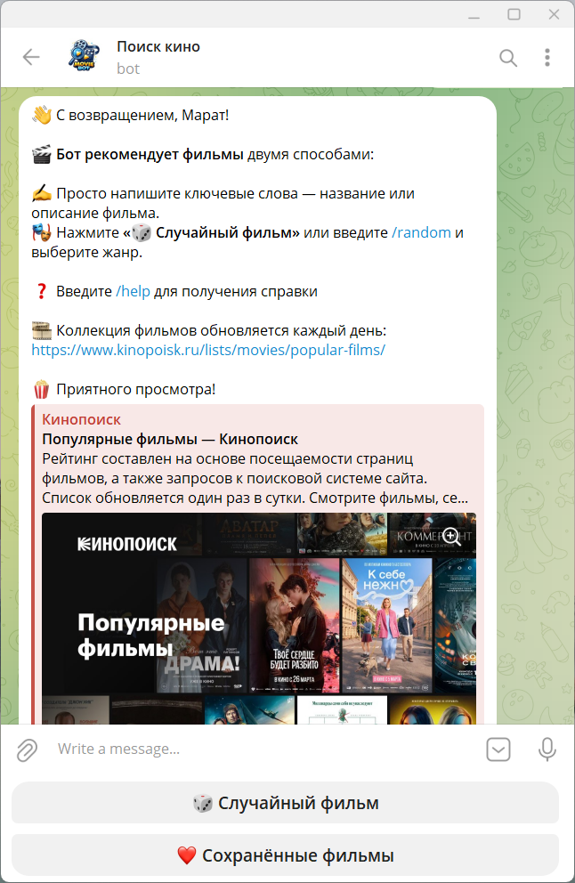

## Скриншот


## Стек
- **Python 3.14**
- **aiogram 3.26.0** — Telegram-бот
- **FastAPI + uvicorn** — веб-фреймворк и сервер
- **httpx** — асинхронные HTTP-запросы к Kinopoisk API
- **Redis** — кеш страниц + индексы для жанров
- **Postgres** — база данных
- **APScheduler** — ежедневный прогрев кеша
- **pydantic-settings** — конфигурация через `.env`

## Получение API-ключей

- **Telegram Bot Token** — создайте бота через [@BotFather](https://t.me/BotFather)  
- **Kinopoisk API Key** — зарегистрируйтесь на [kinopoiskapiunofficial.tech](https://kinopoiskapiunofficial.tech)

## Быстрый старт

### 1. Клонировать и настроить окружение

```bash
git clone https://github.com/marathozin/movie-bot
cd movie-bot
cp .env.example .env
# Открыть .env и вставить BOT_TOKEN и KINOPOISK_API_KEY
# Задать параметры Postgres и Redis
```

### 2. Запуск через Docker Compose (рекомендуется)

```bash
docker compose up --build
```

### 3. Локальный запуск

```bash
# Запустить Redis
docker run -d -p 6379:6379 redis:7-alpine

# Установить зависимости
pip install -r requirements.txt

# Запустить бот (polling-режим)
python main.py
```

## Webhook-режим

Для прода задайте в `.env`:

```env
WEBHOOK_URL=https://yourdomain.com
WEBHOOK_PATH=/webhook
```
